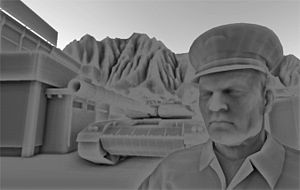

Note
-------
Open.gl的教程算是看完了，其中drawing/texture/transformation/depth and stencil/这4节写了代码来跑例子，而framebuffers\geometry shader\gransform feedback没有写代码。前面部分基本完全翻译了，后面部分仅有部分翻译。可以完善的方面：完成全部的翻译，在XCODE工程中加入后半部分的代码示例，加入光照的内容，完成下列这些更进一步的研究：

- 1，用stencil实现阴影：http://en.wikipedia.org/wiki/Shadow_volume#Stencil_buffer_implementations
- 2，用stancil实现outline：http://www.flipcode.com/archives/Object_Outlining.shtml
- 3，flipcode1999-2005的3D&GDEV文章集: http://www.flipcode.com/archives/
- 4，使用framebuffer进行后期处理的实现：blur模糊等。 
- 5，HDR
- 6，动态模糊，http://http.developer.nvidia.com/GPUGems3/gpugems3_ch27.html

- 7，SSAO(screen space ambient occlusion)
该算法作为像素着色器，通过分析场景中纹理的深度值缓冲来实现，可以近似地表现出物体在环境光下产生的阴影。

- 8，使用transform feedback实现的particle simulation的粒子模拟特效。（粒子的数量、位置、大小、色彩的随机抖动，全部在GPU上计算，性能UP）

Open.GL
-------

This repository hosts the server content of the Open.GL tutorial site. It was
made public to allow people to track changes to the site and suggest
improvements.

License
-------

The code examples (`content/code`) are licensed as
[CC0](http://creativecommons.org/publicdomain/zero/1.0/legalcode), which is
equivalent to public domain in most jurisdictions.

The source code of the site is licensed as MIT and content of the articles as
[CC BY-NC 4.0](http://creativecommons.org/licenses/by-nc/4.0/).
